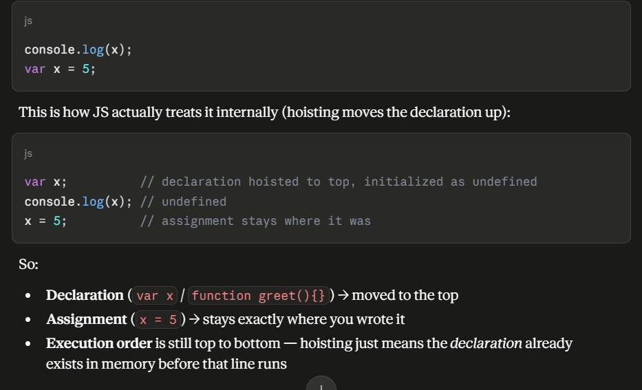
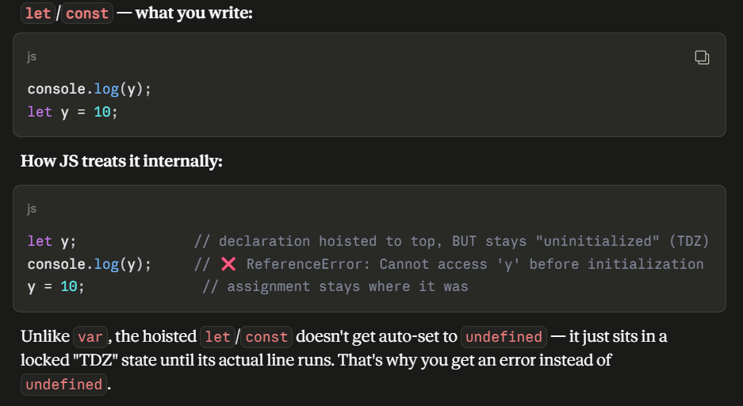
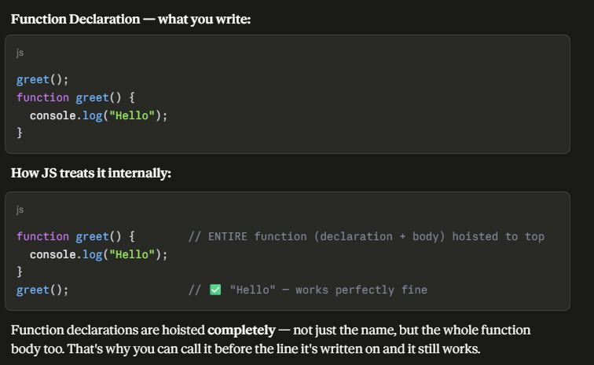
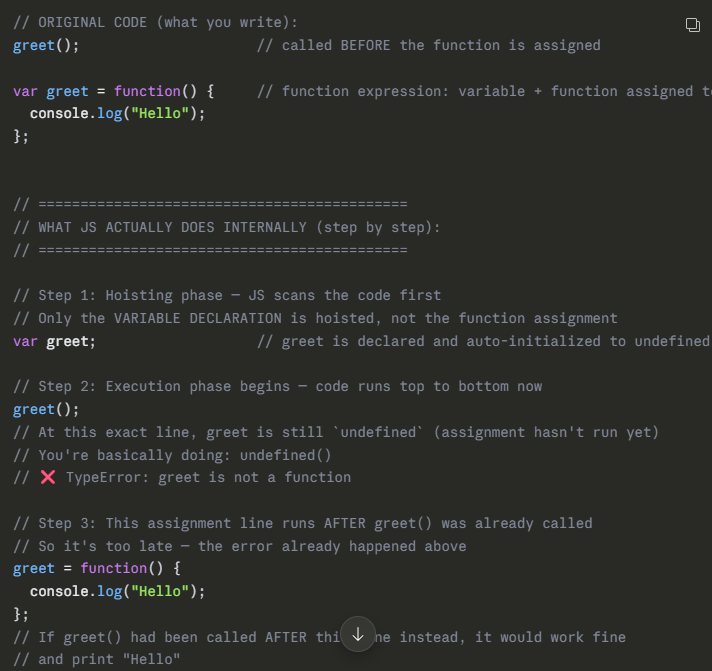

## Q: What is Hoisting?

**Answer:**
Hoisting is JavaScript's behavior of moving variable and function **declarations**
to the top of their scope during the compile phase, before code executes.

- `var` declarations are hoisted and initialized as `undefined`
- `let`/`const` declarations are hoisted but NOT initialized — accessing them before declaration throws an error
- Function declarations are hoisted completely (you can call them before they appear in code)
- Function expressions/arrow functions are NOT hoisted the same way (only the variable is hoisted, not the assignment)

**Example:**
```js
console.log(x); // undefined (not an error)
var x = 5;

console.log(y); // ❌ ReferenceError
let y = 10;

greet(); // "Hello" — works fine
function greet() { console.log("Hello"); }
```

---

### 🔹 var Hoisting



`var` is hoisted and auto-initialized to `undefined`, so accessing it before
its declaration line gives `undefined`, not an error.

---

### 🔹 let / const Hoisting (TDZ)



`let`/`const` are hoisted too, but NOT initialized — they stay in the
**Temporal Dead Zone** until their declaration line runs, so accessing them
early throws a `ReferenceError`.

---

### 🔹 Function Declaration Hoisting



Function declarations are hoisted **completely** — both the name and the
function body — so calling them before their written position works fine.

---

### 🔹 Function Expression Hoisting



Function expressions (`var greet = function(){}`) only hoist the **variable**,
not the function body. Calling `greet()` before the assignment line throws a
`TypeError: greet is not a function`.

---

**Follow-up questions interviewers ask:**
- Why doesn't `let` throw "undefined" like `var` does?
- Are function expressions hoisted?